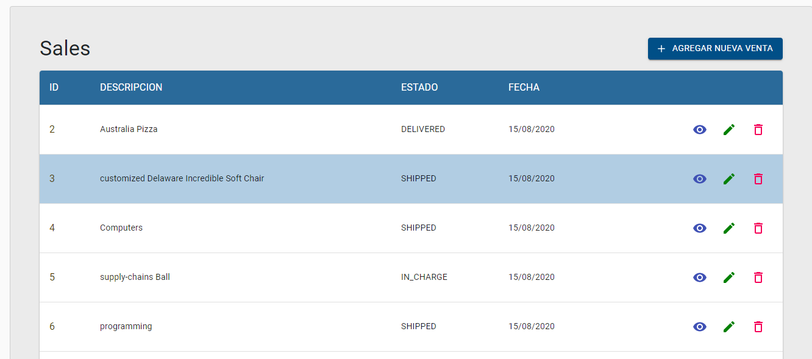
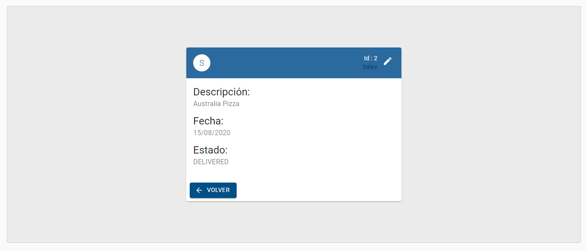
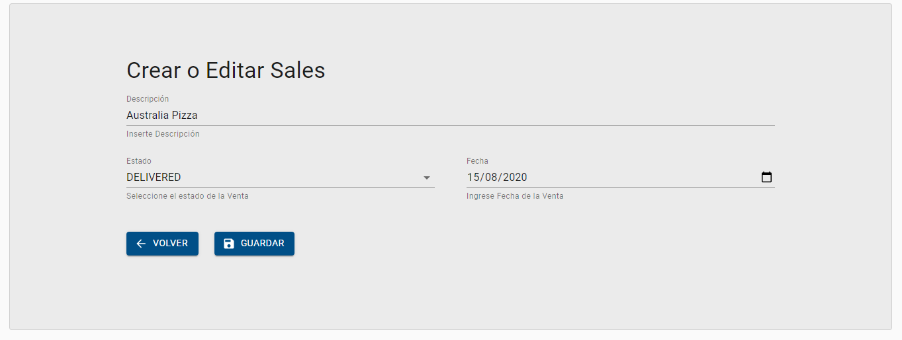
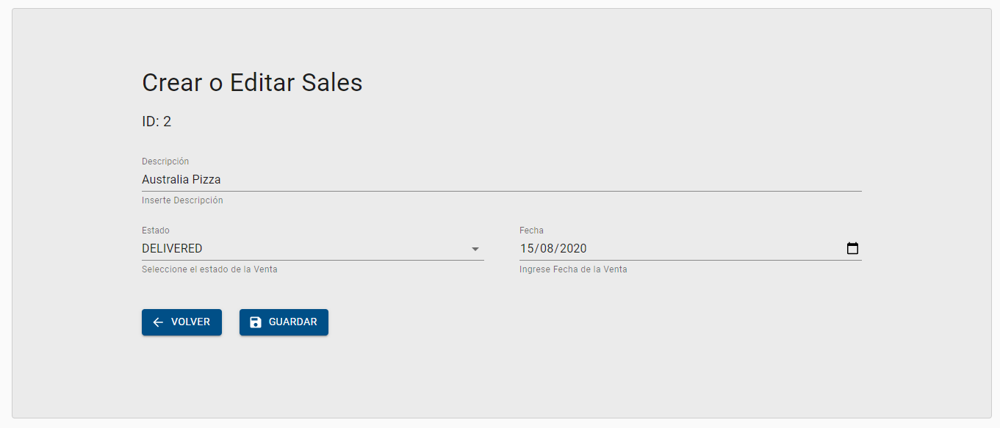
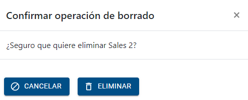

# Ejercicio Final Entrevista Merlion Techs

### Objetivo:

Mejorar la UI de la lista de ventas, la pantalla de creación de ventas y el
detalle de cada venta individual. Utilizando Jhipster y Material UI

Se instaló:

- JHipster https://www.jhipster.tech
- Postgresql 12.x.x https://www.postgresql.org/download/
- Java 8 https://www.java.com/es/download/
- Node https://nodejs.org/es/download/
- Git

Para la adaptación de los componentes se utilizó la librería:

- Material UI https://material-ui.com/

Y la Paleta de colores de la web de la empresa:

- https://www.merliontechs.com/

Se creo una branch en el repositorio por cada componente modificado:

- salesDeleteComponent
- salesUpdateComponent
- SalesDetailComponent
- salesComponent

JDL utilizado para crear la applicación Jhipster:

```sh
entity Sales {
description String
state State
date LocalDate
}
enum State {
IN_CHARGE, SHIPPED, DELIVERED
}
```

En Consola:

```sh
jhipster import-jdl maquetador-jdl.jh
```

# Screens











## Development

Before you can build this project, you must install and configure the following dependencies on your machine:

1. [Node.js][]: We use Node to run a development web server and build the project.
   Depending on your system, you can install Node either from source or as a pre-packaged bundle.

After installing Node, you should be able to run the following command to install development tools.
You will only need to run this command when dependencies change in [package.json](package.json).

```
npm install
```

We use npm scripts and [Webpack][] as our build system.

Run the following commands in two separate terminals to create a blissful development experience where your browser auto-refreshes when files change on your hard drive.

```

./mvnw


npm start
```

Npm is also used to manage CSS and JavaScript dependencies used in this application. You can upgrade dependencies by
specifying a newer version in [package.json](package.json). You can also run `npm update` and `npm install` to manage dependencies.
Add the `help` flag on any command to see how you can use it. For example, `npm help update`.

The `npm run` command will list all of the scripts available to run for this project.
